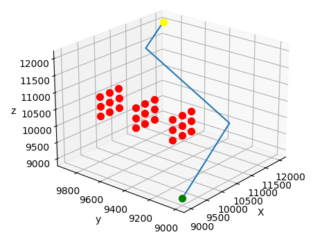

# A_star
A* implementation for 3d Real Vector Spaces

---

Implientation of the A* path planning algorithm for upto a 3 demensional workspace. The planner is implimented in c++ and uses python to plot results.
Note: Inorder to visulaize results with python you must redirect standard output to the storePlot.txt file.  This stored date then gets run through the python script include in the build directory.

Please reach me at pessonmason1@gmail.com if you believe the code can be improved.  Happy for suggestions.

